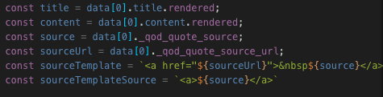
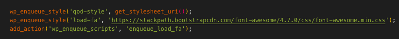

# Project-05 // Quotes on Dev

## A WordPress starter theme for the Quotes on Dev project, forked from Underscores.

## Personal Learnings: 

## JS
- setting up the ajax requests were very similar to Instanews
- creating a const variable for the source URL makes the sources dynamic.
- the popstate function is another way of seeing the url slug change as the previous pages load.
- calling out the contents/title from the REST API file was very similar to Instanews.

## PHP 
- ( 'template-parts/content', 'search' ) means that this template is from the template file called template-search.php
- using wp enqueueu style to upload font awesome icons 
- in page-archives.php, the line <?php 
                wp_tag_cloud(
                    array(
                    'smallest' => 1,
                    'largest' => 1,
                    'unit' => 'rem',
                    'format' => 'list'
                    ));
                ?>
                demonstrated that the keys smallest and largest indicate the size of the tag names.

## CSS 
- using before and after properties to load up font awesome icons

- mandatory to add font awesome as a font family in order to load
- when a styling isnt being added to the browser, it is most likely being over ridden in a different scss file. This taught me to be more familiar with all the scss files in the future when working on a project.

